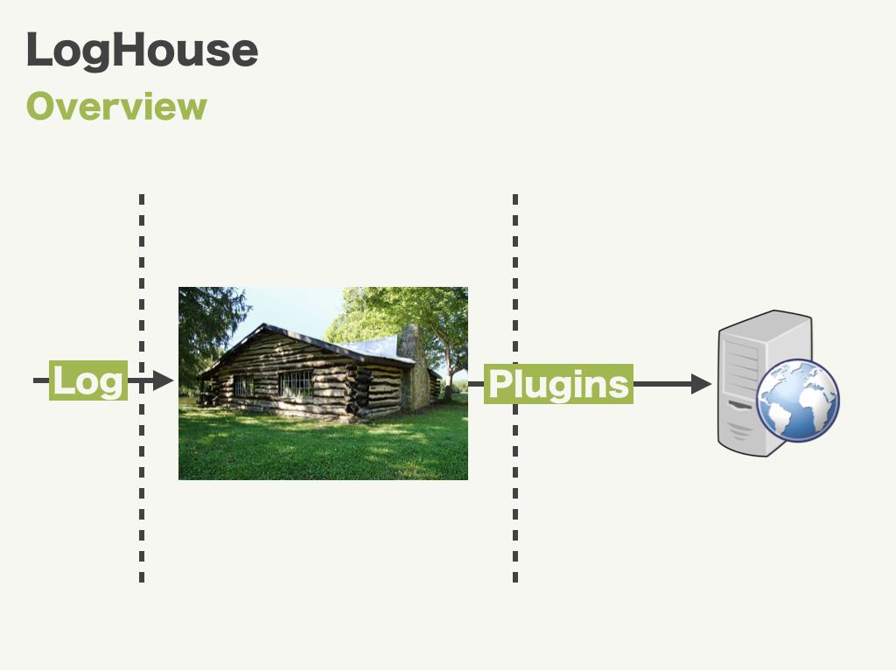
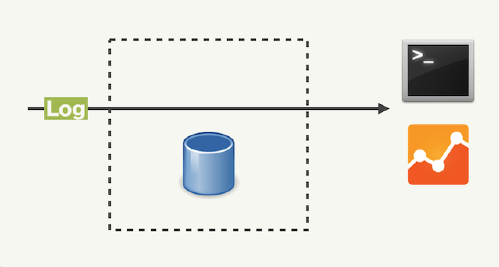
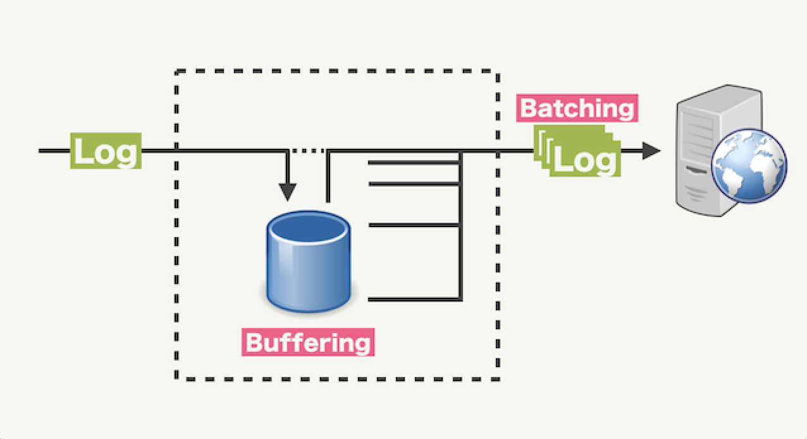

Puree [](https://android-arsenal.com/details/1/1170)
====

## Description

Puree is a log collector which provides some features like below

- Filtering: Enable to interrupt process before sending log. You can add common params to logs, or the sampling of logs.
- Buffering: Store logs to buffer until log was sent.
- Batching: Enable to send logs by 1 request.
- Retrying: Retry to send logs after backoff time automatically if sending logs fails.



Puree helps you unify your logging infrastructure.

## Usage

### Initializing

Configure Puree on application created.

```java
public class DemoApplication extends Application {
    @Override
    public void onCreate() {
        Puree.initialize(buildConfiguration(this));
    }

    public static PureeConfiguration buildConfiguration(Context context) {
        PureeFilter addEventTimeFilter = new AddEventTimeFilter();
        return new PureeConfiguration.Builder(context)
                .registerOutput(new OutLogcat())
                .registerOutput(new OutBufferedLogcat(), addEventTimeFilter)
                .build();
    }
}
```

### Sending logs

Log class should extend JsonConvertible.

```java
public class ClickLog extends JsonConvertible {
    @SerializedName("page")
    private String page;
    @SerializedName("label")
    private String label;

    public ClickLog(String page, String label) {
        this.page = page;
        this.label = label;
    }
}
```

Call `Puree.send` in an arbitary timing.

```java
Puree.send(new ClickLog("MainActivity", "Hello"), OutLogcat.TYPE);
// => {"page":"MainActivity","label":"Hello"}
```

### Create output plugins


There are two types of output plugins: Non-Buffered, Buffered.

- Non-Buffered output plugins do not buffer data and immediately write out results.



- Buffered output plugins store logs to local storage temporary.



You can create a plugin by inheriting Puree.Output or Puree.BufferedOutput. See example plugins below.

- [OutLogcat](https://github.com/cookpad/puree-android/blob/master/plugins%2Fsrc%2Fmain%2Fjava%2Fcom%2Fcookpad%2Fpuree%2Fplugins%2FOutLogcat.java)
- [OutBufferedLogcat](https://github.com/cookpad/puree-android/blob/master/plugins%2Fsrc%2Fmain%2Fjava%2Fcom%2Fcookpad%2Fpuree%2Fplugins%2FOutBufferedLogcat.java)

## Download

Reference on jcenter as

```
// build.gradle
buildscript {
    repositories {
        jcenter()
    }
    ...

// app/build.gradle
compile 'com.cookpad:puree:1.1.0'
```
